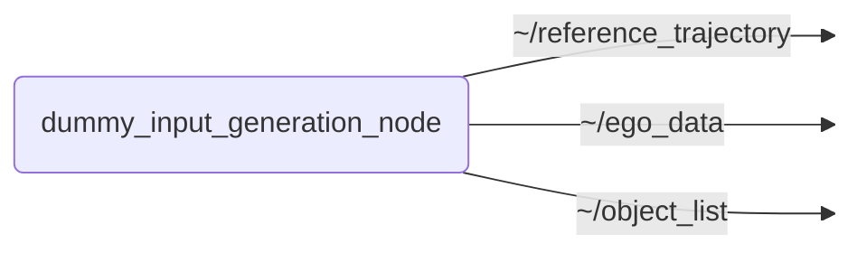

# `dummy_input_generation`

Generates and publishes dummy input data for testing purposes of the trajectory optimization node.

- [Nodes](#nodes)
  - [dummy_input_generation_node](#dummy_input_generation_node)
- [Launch Files](#launch-files)

## Nodes

### `dummy_input_generation_node`

#### Published Topics

| Topic | Type | Description |
| --- | --- | --- |
| `~/reference_trajectory` | `trajectory_planning_msgs/msg/Trajectory` | Dummy reference trajectory; configurable via params |
| `~/ego_data` | `perception_msgs/msg/EgoData` | Dummy EgoData; configurable via params |
| `~/object_list` | `perception_msgs/msg/ObjectList` | Dummy object list; configurable via params |

#### Parameters

| Parameter | Type | Default | Description |
| --- | --- | --- | --- |
| `publish_frequency` | `float` | `10.0` | Publish frequency in Hz |
| `message_frame_id` | `string` | `"map"` | Common frame ID for all published messages |
| `ego_state_model` | `string` | `"ackermann"` | Ego state model used for published EgoData |
| `ego_vel_lon` | `float` | `0.0` | Ego longitudinal velocity [m/s] |
| `ego_acc_lon` | `float` | `0.0` | Ego longitudinal acceleration [m/s^2] |
| `ego_steering_angle_ack` | `float` | `0.0` | Ackermann steering angle [rad] |
| `ego_steering_angle_front` | `float` | `0.0` | Front steering angle for RWS [rad] |
| `ego_steering_angle_rear` | `float` | `0.0` | Rear steering angle for RWS [rad] |
| `ego_translation_to_geometric_center` | `float[]` | `[1.4895, 0.0, 0.420]` | Translation from ego reference point to geometric center [x, y, z] |
| `reference_n_states` | `int` | `51` | Number of reference trajectory states |
| `reference_trajectory_horizon` | `float` | `5.0` | Reference trajectory horizon in seconds |
| `reference_standstill` | `bool` | `false` | Publish reference trajectory with standstill flag |
| `reference_x0` | `float` | `0.0` | Initial x position of reference trajectory |
| `reference_y0` | `float` | `0.0` | Initial y position of reference trajectory |
| `reference_v0` | `float` | `0.0` | Initial velocity of reference trajectory |
| `reference_a` | `float` | `1.0` | Acceleration of reference trajectory |
| `reference_theta0` | `float` | `0.0` | Initial heading angle of reference trajectory [deg] |
| `reference_omega` | `float` | `0.0` | Angular velocity of reference trajectory [deg/s] |
| `object_count` | `int` | `10` | Number of objects in object list |
| `object_delta_x` | `float` | `10.0` | Delta x between objects |
| `object_delta_y` | `float` | `0.0` | Delta y between objects |
| `object_length` | `float` | `4.0` | Object length [m] |
| `object_width` | `float` | `2.0` | Object width [m] |
| `object_yaw` | `float` | `0.0` | Object yaw [rad] |

## Launch Files

### [`dummy_input_generation_node.launch.py`](launch/dummy_input_generation_node.launch.py)

| Argument | Default | Description |
| --- | --- | --- |
| `ego_data_topic` | `"~/ego_data"` |  |
| `object_list_topic` | `"~/object_list"` |  |
| `reference_trajectory_topic` | `"~/reference_trajectory"` |  |
| `name` | `"dummy_input_generation_node"` | node name |
| `namespace` | `""` | node namespace |
| `params` | `os.path.join(get_package_share_directory("dummy_input_generation"), "config", "params.yml")` | path to parameter file |
| `log_level` | `"info"` | ROS logging level (debug, info, warn, error, fatal) |
| `use_sim_time` | `"false"` | use simulation clock |
| `trace` | `"false"` | enable tracing |
