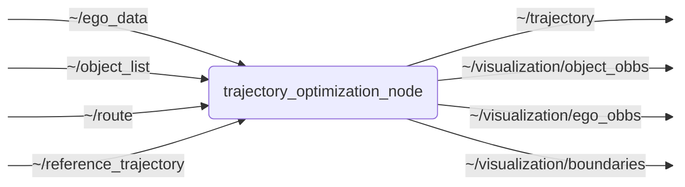

# `trajectory_optimization`

Periodically solves a nonlinear OCP to generate optimized trajectories for automated driving.

## Nodes

### `trajectory_optimization_node`

#### Subscribed Topics

| Topic | Type | Description |
| --- | --- | --- |
| `~/ego_data` | `perception_msgs/msg/EgoData` | Current ego vehicle state used to initialize and time-stamp the optimization problem. |
| `~/object_list` | `perception_msgs/msg/ObjectList` | List of objects, that are considered as obstacles in the OCP to avoid collisions. Depending on the configuration, objects can be considered as static (no prediction) or dynamic (with prediction). |
| `~/route` | `route_planning_msgs/msg/Route` | Route and lane boundary information used to constrain the OCP. |
| `~/reference_trajectory` | `trajectory_planning_msgs/msg/Trajectory` | Reference trajectory the OCP should follow. Depending on the configuration, the OCP can be set to run periodically on a timer or to run once for each received reference trajectory. |

#### Published Topics

| Topic | Type | Description |
| --- | --- | --- |
| `~/trajectory` | `trajectory_planning_msgs/msg/Trajectory` | Result of the OCP as drivable trajectory in the configured output frame. |
| `~/visualization/object_obbs` | `visualization_msgs/msg/MarkerArray` | Debug markers visualizing the obstacle OBBs used by the OCP. |
| `~/visualization/ego_obbs` | `visualization_msgs/msg/MarkerArray` | Debug markers visualizing the ego OBB used inside the OCP. |
| `~/visualization/boundaries` | `visualization_msgs/msg/MarkerArray` | Debug markers visualizing boundary points considered by the OCP. |

#### Parameters

| Parameter | Type | Default | Description |
| --- | --- | --- | --- |
| `vehicle_frame_id` | `string` | `"base_link"` | Frame ID of local vehicle frame (the ocp is defined in this frame) |
| `trajectory_frame_id` | `string` | `"base_link"` | Frame ID of output trajectory |
| `fixed_over_time_frame_id` | `string` | `"map"` | Frame ID of frame that is fixed over time for finding temporal transforms |
| `ego_data_timeout` | `float` | `1.0` | Time after which a received ego vehicle data is considered invalid [s]. Optimization will not be run if ego data is invalid. |
| `model_name` | `string` | `"karl"` | Name of the model to be used for trajectory optimization [karl, shuttle] |
| `optimization_frequency` | `float` | `10.0` | Optimization frequency in Hz |
| `n_shots` | `int` | `50` | Number of shooting intervals in optimization horizon |
| `optimization_horizon` | `float` | `1.0` | Optimization Horizon in seconds |
| `verbose` | `bool` | `false` | Print solver statistics |
| `performance_logging` | `bool` | `false` | Write one CSV record for every completed solver run |
| `debug_visualization` | `bool` | `false` | Publish debug visualization markers for ego and obstacle OBBs |
| `run_as_callback` | `bool` | `false` | Run OCP once for each received reference trajectory (true) or on a timer (false) |
| `double_solve` | `bool` | `true` | Initialize the fully constrained OCP with a solve that ignores object and boundary constraints |
| `relaxed_solve_timeout_ms` | `float` | `100.0` | ACADOS timeout for the relaxed initialization solve in milliseconds; `0` disables the timeout |
| `constrained_solve_timeout_ms` | `float` | `100.0` | ACADOS timeout for the fully constrained solve in milliseconds; `0` disables the timeout |
| `cost_weights` | `float[]` | `std::vector<double>(12, 1.0)` | Cost function weights |
| `dynamic_weight` | `float` | `1.0` | Dynamic weight alpha |
| `thw` | `float` | `2.0` | Time headway to front vehicle |
| `d_min_obstacle_long` | `float` | `5.0` | Minimum distance to keep to obstacle in longitudinal direction [m] |
| `d_min_obstacle_lat` | `float` | `0.5` | Minimum distance to keep to obstacle in lateral direction [m] |
| `d_min_boundary_lat` | `float` | `0.0` | Minimum distance to keep to boundary in lateral direction [m] |
| `standstill_threshold` | `float` | `0.45` | Threshold for standstill detection [m/s]. If the velocities of all states are below this threshold, publish standstill trajectory |
| `high_level_stabilization` | `bool` | `false` | Use high-level stabilization strategy for init state (= init with current EgoData) |
| `consider_objects` | `int` | `2` | consider objects in optimization: 0 = none, 1 = static (no prediction), 2 = dynamic (with prediction) |
| `min_prediction_probability` | `float` | `0.0` | Minimum probability for predicted object states to be considered |
| `consider_boundaries` | `int` | `1` | consider route boundaries in optimization: 0 = no, 1 = suggested lane, 2 = including adjacent, 3 = drivable space |
| `bi_level_dV` | `float` | `2.0` | Threshold for bi-level stabilization: maximum velocity difference [m/s] |
| `bi_level_dY` | `float` | `0.3` | Threshold for bi-level stabilization: maximum y-offset [m] |
| `bi_level_dYaw` | `float` | `89.0` | Threshold for bi-level stabilization: maximum yaw difference [degree] |

Both vehicle models use one smooth conservative SAT constraint per obstacle OBB and two OBB-support constraints for the route
boundaries. Their longitudinal obstacle margin is applied in front of the vehicle; the rear uses a fixed 0.1 m clearance. If object
or boundary constraints are active and `double_solve` is enabled, both vehicle models first solve the same OCP with only these safety
constraints disabled. The result initializes a second solve with all configured constraints restored. Only a primal-feasible result
of the second solve may be published; the intermediate trajectory is never an output candidate. If `double_solve` is disabled, the
fully constrained OCP is solved directly from the normal dynamically consistent warm start. Both solve phases have independently
configurable timeouts.

## Launch Files

### [`trajectory_optimization.launch.py`](launch/trajectory_optimization.launch.py)

| Argument | Default | Description |
| --- | --- | --- |
| `ego_data_topic` | `"~/ego_data"` | Topic on which to subscribe EgoData |
| `object_list_topic` | `"~/object_list"` | Topic on which to subscribe ObjectList |
| `reference_trajectory_topic` | `"~/reference_trajectory"` | Topic on which to subscribe reference trajectory |
| `route_topic` | `"~/route"` | Topic on which to subscribe route |
| `trajectory_topic` | `"~/trajectory"` | Topic on which to publish optimized trajectory |
| `boundary_marker_topic` | `"~/visualization/boundaries"` | Topic on which to publish boundary visualization markers |
| `ego_obbs_topic` | `"~/visualization/ego_obbs"` | Topic on which to publish ego OBB visualization markers |
| `object_obbs_topic` | `"~/visualization/object_obbs"` | Topic on which to publish object OBB visualization markers |
| `name` | `executable_name` | node name |
| `namespace` | `""` | node namespace |
| `params` | `os.path.join(get_package_share_directory("trajectory_optimization"), "config", "params.yml")` | path to parameter file |
| `log_level` | `"info"` | ROS logging level (debug, info, warn, error, fatal) |
| `use_sim_time` | `"false"` | use simulation clock |
| `ros_tracing` | `"false"` | enable tracing |
| `driving_mode` | `"ackermann"` | driving mode, which determines the model and cost function configuration used for optimization [ackermann, rws] |

### [`trajectory_optimization_demo.launch.py`](launch/trajectory_optimization_demo.launch.py)
